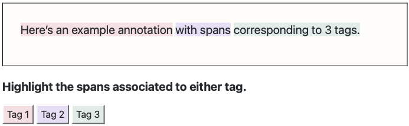

<div style="display: flex; justify-content: center; align-items: center; text-align: center;">
  <h1 style="flex: 1;">Span Annotation<br>
  </h1>
</div>

<div>
<p align="left">
    This repository contains the codebase for a span-based text annotation interface.
The interface is designed for small-scale projects, with a
minimalistic annotation workflow.
  </p>
</div>

<div align="center">
  


</div>


# How to Use

To have the interface up and running, you need to install the necessary dependencies.

You can perform these steps on a server or your local machine, depending on where you want to host the interface.

## (One-time) Configurations

1. Clone this repository in a dedicated folder

```
$ makedir myapp
$ cd myapp
$ gh repo clone cltl/span-annotation-tool
```

2. Assuming you have python3 installed on your machine, do:
```
$ pip3 install Flask
$ pip3 install Flask-Session
$ pip3 install Flask-Caching
$ pip3 install pandas
```

3. Put your own annotation guidelines (Annotation_guidelines.pdf) in `./scripts/static`. 
Put your data in the folder `./input`: this file must be in .tsv format, and have a column with an identificator for each text (e.g., a number).

4. Change the `config.ini` file according to your needs:

| [general]   |   |
| ---------- | ---------- |
| title | This will be shown as the annotation title. |
|guidelines_location| Write here the name of the file containing your annotation guidelines, for the users. |
|authorized_users| This must be a comma-separated list of the emails of users who are authorized to take the annotation.|

|[data]| |
| ---------- | ---------- |
|data_file | The name of your annotation input file. |
|text_column | The name of the column with the texts to be annotated. |
|text_id_column | The name of the column containing an id for each text.|

|[annotations]||
| ---------- | ---------- |
|TAGS_SHORT | Abbreviations for the used tags. If more than one, they must be separated by a `-`. |
|TAGS_LONG | Plain names of the tags (this is what the annotation users will see), separated by a `-`.|
|TAG_COLORS | Colors (separated by a `-`) that will be used to highlight the spans corresponding to the tags.|

|[questions]||
| ---------- | ---------- |
|span_question | This is the question shown to the users to perform the span annotation task. |
|trigger | The tag abbreviation that triggers the type-in question. If the type-in question is unnecessary, set to `None`.|
|type_in_question | This question is asked to have the annotators fill in a text input field. As opposed to span_question, this one is optional. If you don't need it, set to `None`.|


## Using the interface

1. Run the app
```
$ python3 app.py
```

2. Open a browser (if running local, open your browser and go to
[http://127.0.0.1:5000/](http://127.0.0.1:5000/) or [http://localhost:5000](http://localhost:5000))
and annotate!

    The result will be stored in 
`./outputs/` is .json format.

---

This tool is developed as part of the [CLARIAH](https://www.clariah.nl) consortium.

<div align="center">
  


</div>